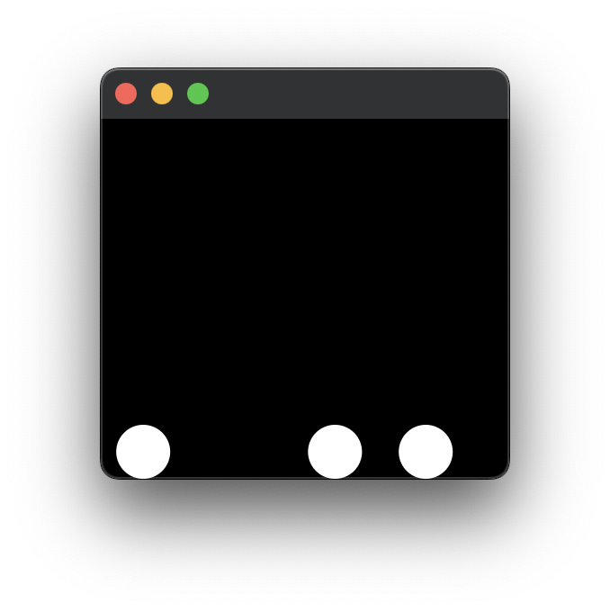
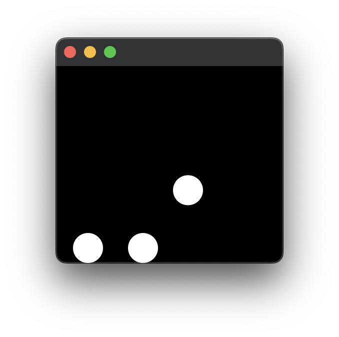
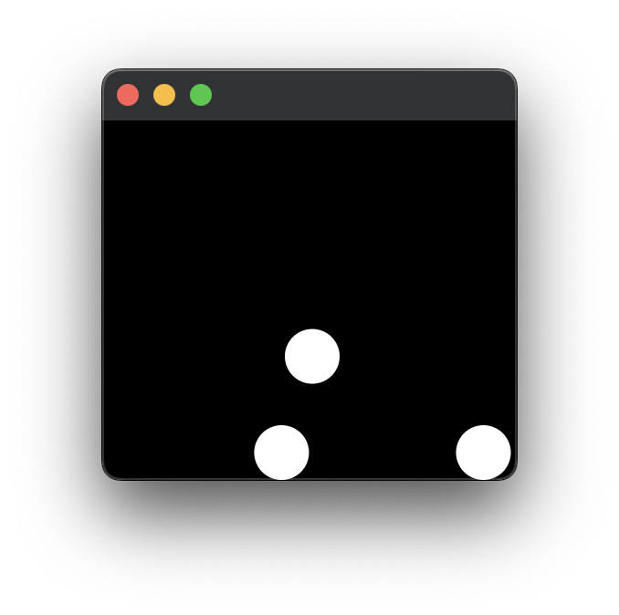
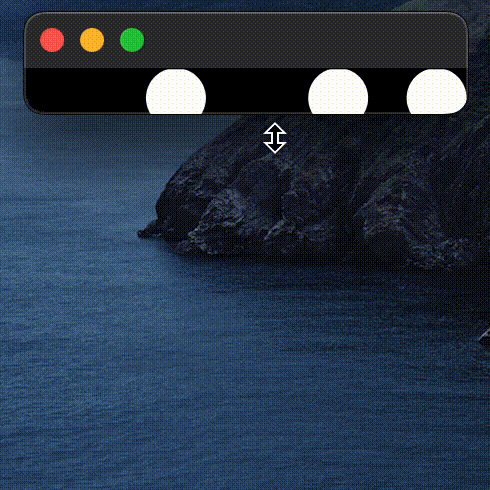

# PhysicsX

**Physics Simulator** is an interactive simulation application developed in Java using JavaFX. It models the motion and collision of multiple spherical objects (balls) within a dynamically sized, bounded environment. The simulation incorporates basic principles of Newtonian physics, including gravity and elastic collisions.

## Features

- Realistic Physics: Simulates gravitational acceleration and elastic collisions between balls.
- Interactive UI: Users can click, drag, and release balls to apply custom velocity vectors.
- Responsive Layout: Simulation boundaries adapt in real time to window resizing, ensuring consistent behavior across various screen sizes.

## Project Structure

- `Main.java`  
  Initializes the JavaFX application and sets up the primary window (stage) and scene.

- `PhysicsController.java`  
  Acts as the main simulation loop controller. Handles animation, timing, and physical updates per frame.

- `BallManager.java`  
  Maintains and updates the collection of balls. Responsible for resolving collisions and managing ball interactions.

- `Ball.java`  
  Represents an individual ball, encapsulating properties such as position, velocity, radius, and physical behaviors.

- `Boundary.java`  
  Defines the simulation area's limits. Handles boundary collision detection and response.

## Dependencies

- JavaFX — For UI rendering and animation support
- Lombok — To reduce boilerplate code (e.g., getters and setters)

## Usage

1. Launch the application via your preferred IDE or build tool.
2. Use the mouse to click and drag any ball. Upon release, the ball will move with velocity proportional to the drag motion.
3. Observe the balls interacting under the influence of gravity, bouncing off each other and the simulation boundaries.

## Demo Showcase

The following screenshots demonstrate the core features of the physics simulator, including gravity, ball-to-ball collision, boundary collision, and user interactions.

### Demo
### Demo
   
 

